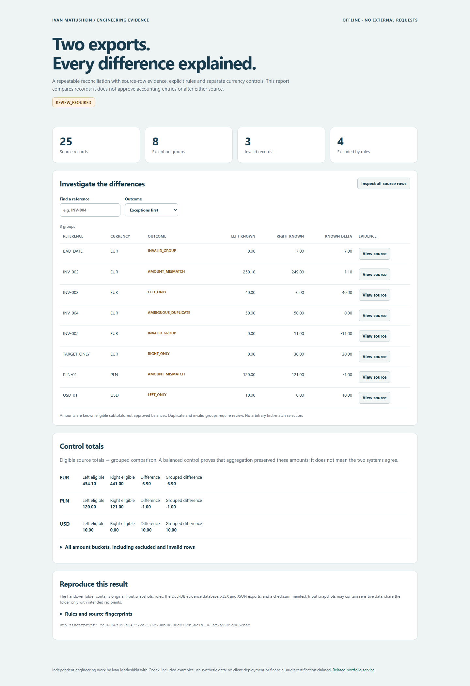

# Reconciliation Evidence Workbench

[](https://github.com/Hadezu/reconciliation-evidence-workbench/actions/workflows/verify.yml)

**Two exports disagree. Which rows explain the difference — and did the comparison lose anything?**

An offline Python/DuckDB tool that compares separately mapped CSV/XLSX exports and hands over an interactive HTML report, an XLSX review workbook, original input snapshots, inspectable SQL/database and checksums.

Independent engineering work by **Ivan Matiushkin with Codex**. Included data is synthetic. This supports the existing [report reconciliation service](https://work.matiushkin.com/en/proof/revenue-bi); it is not client history or a financial audit.

[Case study and buyer requirements](docs/CASE-STUDY.md) · [Contract and architecture](docs/CONTRACT.md) · [Verification](docs/VERIFICATION.md) · [Portfolio/email copy](docs/COMMERCIAL-USAGE.md)



[60-second demonstration](docs/DEMO.md) · [Downloadable package and synthetic evidence](https://github.com/Hadezu/reconciliation-evidence-workbench/releases/tag/v0.1.0)

## What makes the result inspectable

- Two different input formats and column mappings; leading-zero text identifiers preserved.
- Exact integer money calculations; EUR, PLN and USD kept separate. No FX or silent rounding.
- Every read tabular record classified as eligible, excluded or invalid, with original cells and source row.
- All occurrences of duplicate keys quarantined as ambiguous, even when their amounts sum to the other side. No accidental many-to-many join or first-match selection.
- A malformed duplicate cannot disappear and make the other record look unique.
- UTC reporting boundaries and explicit status/period exclusions.
- Currency control totals independently reconcile source amounts to grouped results.
- Input hashes, deterministic JSON, retained SQL and a DuckDB database for a technical reviewer.
- Complete output published by same-filesystem directory rename; handled export failures leave no partially published run. Existing output is never overwritten.

## Run the demonstration

Python 3.12–3.14 and [uv](https://docs.astral.sh/uv/) are required. No account, API key or Docker.

```sh
uv sync --locked
uv run recon run --left examples/ledger.csv --right examples/target.xlsx --rules examples/rules.json --out output/demo
```

**Exit code 2 is intentional:** the synthetic files contain discrepancies. It means a complete report needs review, not that generation failed. Open `output/demo/report.html` in your browser and `output/demo/reconciliation.xlsx` in a spreadsheet viewer.

```sh
uv run recon verify output/demo
uv run pytest -q
uv run ruff check src tests scripts browser_checks
```

The sample accounts for **25 rows: 18 eligible, 3 invalid, 4 excluded**. It has **8 exception groups**. EUR eligible totals are **434.10 vs 441.00**, a **−6.90** difference. PLN and USD have their own controls. Expected answers are recorded in `examples/expected.json`; see the hand calculation in the case study.

Try `INV-004`: two left records of 20 and 30 against one right record of 50 remain **AMBIGUOUS_DUPLICATE**, even though the difference is zero. A person must agree the business rule before any consolidation.

## Your own bounded comparison

Copy `examples/rules.json`, explicitly map five columns per side (`key`, `currency`, `amount`, `date`, `status`), select the XLSX worksheet and the half-open reporting period. Decimal separators and included statuses are per source. Keys are case-sensitive after trimming; no fuzzy identity matching.

```sh
uv run recon run --left source.csv --right target.xlsx --rules agreed-rules.json --out output/new-run
```

- `0`: reconciled under the explicit rules (including any nonzero tolerance).
- `2`: report complete, review required or no comparable data.
- `1`: processing failed; no successful report claimed.

Source files are never modified. The evidence folder **contains exact input copies**; do not publish a customer's folder. The checked-in example contains invented records only. The application makes no network requests; dependencies download during installation. The portfolio footer link is an ordinary link opened only if clicked.

## Scope and limitations

At most 8 MB / 25,000 records per source, 40 columns, 2,000 characters per cell; XLSX expanded size at most 40 MB. These are parser bounds, not a performance SLA. Date/timestamp and amount conventions are deliberately strict; read [the contract](docs/CONTRACT.md) before using another export layout.

No PDF/OCR, AI extraction, Power BI, bank/ERP connector, multi-user server, automatic corrections, many-to-one settlement allocation, accounting certification or production deployment is included. A matching pair proves agreement under the chosen key/rules, not that the source records are true.

## Engineering and attribution

This is a new scoped tool, not a fork presented as original work. Existing cases already demonstrate modification of Atomic CRM, Java maintenance and webhook recovery. This project fills a different gap: real file ingestion, reproducible analytical comparison and portable evidence handover.

DuckDB supplies the SQL engine; openpyxl supplies XLSX IO; Pydantic validates rules; defusedxml rejects XML entity expansion. Their licenses and authors remain theirs. [Dependency attribution](docs/ATTRIBUTION.md). Our code is MIT.

[Portfolio](https://work.matiushkin.com/en) · [GitHub](https://github.com/Hadezu) · ivan@matiushkin.com

<details>
<summary>Technical verification recording</summary>

Original test recording retained as supporting evidence. For the scenario, results and limitations, see the verification documentation above.

[Download the original recording](https://github.com/Hadezu/reconciliation-evidence-workbench/releases/download/v0.1.0/review-demo.webm)

</details>
