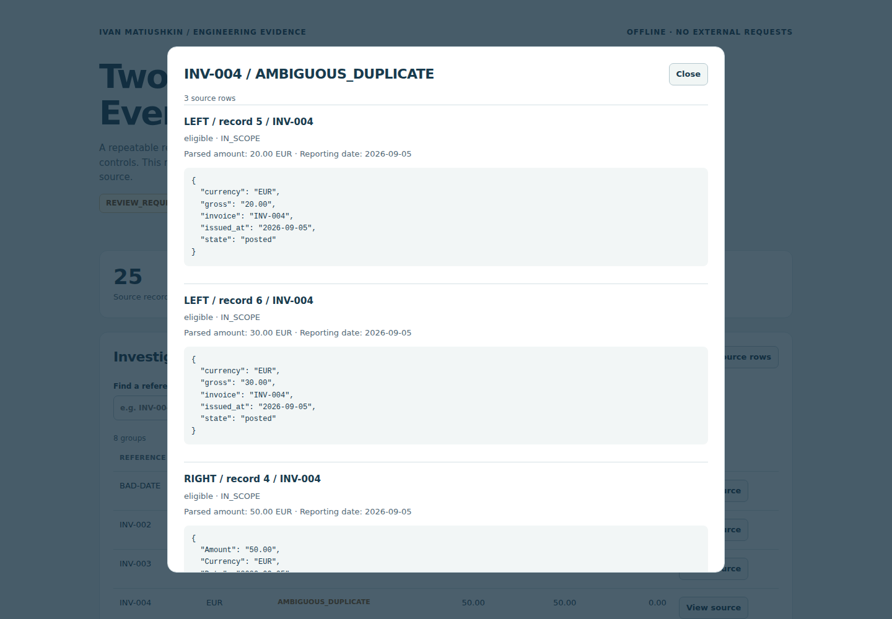
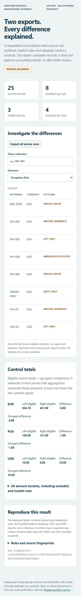

# A 60-second inspection

Use the included synthetic sample only. [Release assets](https://github.com/Hadezu/reconciliation-evidence-workbench/releases/tag/v0.1.0) include `synthetic-evidence.zip`; extract it before opening `report.html`. No installation is required to view HTML/XLSX. To reproduce the calculation, follow the README commands.

1. Start with the four counters: 25 source records, 8 exception groups, 3 invalid records, 4 rule exclusions.
2. Open **View source** for `INV-004`. Two left records (20 and 30) and one right record (50) have equal subtotals, but the match is ambiguous. No record was chosen or merged automatically.
3. Search `INV-002`. The source amounts are 250.10 and 249.00; their difference is 1.10. Open the evidence to see both original rows.
4. Clear search and choose **Matched** to see the three actual matches. **All outcomes** restores all 11 groups.
5. Inspect all source rows to find the invalid row without an identifier; it has not disappeared simply because it cannot form a match.
6. Look at currency controls: EUR −6.90, PLN −1.00, USD +10.00. The grouped differences equal the eligible source differences. They are not combined into a meaningless mixed-currency total.

[Download the original Chromium recording](https://github.com/Hadezu/reconciliation-evidence-workbench/releases/download/v0.1.0/review-demo.webm). The short recording follows the automated review scenario; the numbered walkthrough above is a slower inspection guide.

Screenshots and video were captured on 2026-10-05 by the **successful local Windows/Chromium acceptance test**, against implementation `89e3c8703d8986cc61b4bf35181a1eda2059c535`. They replace the preliminary captures from the earlier incomplete CI run. The recording contains real interactions with generated synthetic output, not a mockup. Full verification scope, including completed Linux and Windows checks, is in [Verification](VERIFICATION.md).

Mobile report — 390px viewport

The comparison table scrolls horizontally inside its container; the page itself does not overflow.

The review workbook contains Summary, Reconciliation, Source rows and Rules. Monetary values are exact decimal text, deliberately not editable formulas. `manifest.json` allows `recon verify` to detect altered or missing evidence files; it is not a digital signature.
